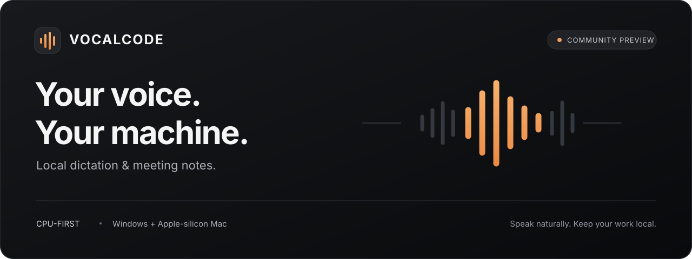

<p align="center">
  
</p>

<p align="center"><strong>本地听写与会议记录，为 CPU 桌面设备设计。</strong></p>
<p align="center"><a href="README.md">English</a> · 简体中文</p>
<p align="center">维护者：<a href="https://github.com/wudaming00">Daming Wu</a> · <a href="LICENSE">AGPL-3.0-only</a> · <a href="MAINTAINERS.md">联系与参与</a></p>

> **VocalCode 免费且开源（AGPL-3.0）：全部功能，无需账户，无需激活。**
> [下载与发布状态](https://github.com/wudaming00/vocalcode-community/releases)：
> Windows 签名安装包与 Apple-silicon macOS 公证安装包只有通过发布检查后才会公开。
> `source-preview-*` 标签仅有源码。详见 [验证范围与局限](PUBLICATION_BLOCKERS.md)。

[](https://github.com/wudaming00/vocalcode-community/actions/workflows/community-ci.yml)

## 我是谁，为什么做这个

我是 **Daming Wu**，VocalCode 的维护者。最初做它，是想直接说出给编程工具的长提示词，
而不是每一句都用键盘打出来。后来逐步加入了本地会议记录、个人词典和可找回的听写历史。

我希望语音识别留在自己的电脑上，不强制独立显卡，也让用户清楚知道录了什么、保存了什么。
准备开放源码，是想把精力更多放在产品本身，让真实问题、语言测试和改进能共同积累。

欢迎一起把原项目做好：提供可复现的错误、测试不同语言和设备、改善键盘操作，或者提交小而可靠
的修复。不写 Rust 也能参与。参阅 [近期方向](ROADMAP.md)、[贡献指南](CONTRIBUTING.md)
和 [维护者与联系方式](MAINTAINERS.md)。独立分支也是开源允许的选择，不强制贡献回本项目。

## 可以做什么

- **对着电脑说话，文字进入输入框**：按住快捷键开始听写，保留前台窗口及焦点安全校验。
- **在本地记录会议**：麦克风与系统音频、音频导入、转写检索、笔记、书签与导出。
- **让词典适应你的工作**：手动词典、自动纠错学习，以及可编辑、可撤销的学习提示。
- **找回未成功输入的文字**：历史记录在本机加密保留最近的听写（关闭 / 24 小时 / 7 天）；没能输入出去的文字会一直留到退出为止。本地诊断另有独立的容量控制与导出。
- **选择适合的模型**：支持不同语言的本地模型路线，不要求独立显卡。

VocalCode 开放全部功能，无需账户、付费或激活码。录音仍须你确认并取得参与者许可。

### 新安装的默认设置

| 设置 | 新安装 | 在哪里更改 |
| --- | --- | --- |
| 鼠标后退键（X1）当回车 | 关闭。首次设置时提供一个默认不勾选的选项：**把鼠标后退键当作回车键**。 | 快捷键 → 点按发送 |
| 过滤非人声噪音 | 开启。不开的话，风扇、键盘或粉红噪声可能被打成 “I.”、“그.”、“我。”。 | 设置 → 听写 |
| 保留历史记录 | 7 天：最多 50 条最近的听写，用 Windows 账户或钥匙串密钥加密，到期删除。选择“关闭”会删除已保留的内容。卸载不会删除；在 设置 → 系统 里点 **删除…** 才会删除。 | 历史记录 |

升级不会改变已有安装的这些设置。1.4.0 及更早版本写下的设置：原来后退键当回车的继续当回车，
噪音过滤保持关闭，历史记录仍只保留本次运行，直到你自己更改。
本版本保存的设置使用新版设置格式，1.4.0 及更早版本读到它会无法启动，所以不支持降级回旧版本。

当前**开发工作区**还加入了默认关闭的 Windows 桌面控制条，以及手动智能改写草稿。
控制条复用现有听写引擎；改写默认使用已安装的本地 Ollama，Claude CLI 为逐次同意的可选项。
这些改动本轮尚未发布，也没有覆盖现有安装。参阅 [开发验证记录](docs/product-polish-2026-09-23/RESULTS.zh-CN.md)
和 [智能改写边界](docs/SMART-REWRITE.md)。

## 安装或自行构建

打开 [Releases](https://github.com/wudaming00/vocalcode-community/releases)，选择稳定的 `v*` 版本。
Windows x64 下载 `VocalCodeSetup.exe`；Apple 芯片 Mac 下载
`VocalCode-<版本>.dmg`，将 **VocalCode.app** 拖到 Applications。
同页提供与安装包对应的源码及 SHA-256 校验文件。

先按 [构建文档](BUILDING.md) 安装 Rust、原生编译工具及运行环境，再执行：

```sh
git clone https://github.com/wudaming00/vocalcode-community.git
cd vocalcode-community
cargo build -p vocalcode-app --release --locked --features community
```

`community` 构建选项（默认开启）即免费版本，显式写出只是为了清楚。自行构建的是开发版：
它有自己的数据文件夹（`VocalCode Dev`）和开机启动项，不会读取或改动已安装 VocalCode 的数据，
详见 [构建文档](BUILDING.md#development-builds-and-an-installed-vocalcode)。

**从旧版 VocalCode 过来。** VocalCode 安装在付费版（1.2.1 及更早）原来的位置，并使用同一个数据
文件夹，所以装在付费版上面会原地替换它，设置、词典、会议记录和已下载的模型都原样保留，无需导入。
如果付费版是用 Scoop 安装的，请先运行 `scoop uninstall vocalcode`（数据文件夹会保留），再安装 VocalCode：
Scoop 解包的副本无法原地更新，它的更新会失败且不改动任何东西。如果之前开启了开机启动，请在 VocalCode 里重新打开。
早期免费版 VocalCode Community 1.3.1 和 1.4.0 是单独安装的：Windows 安装程序会卸载它并保留它的
数据文件夹，在 **设置 → 系统 → 旧版 VocalCode** 里可以选择要复制过来的内容。
不要同时运行两个副本，否则每次听写都会被输入两遍。

## 开始使用

第一次打开只需三步：

1. **选择最常说的语言。** 只下载这种语言所需的本地模型，选完立即开始下载。
2. **确认说话键。** 只有按住说话键时 VocalCode 才会录音。默认已绑定：

   | 平台 | 默认说话键 |
   | --- | --- |
   | Windows | 鼠标前进侧键（X2）、右 Ctrl |
   | macOS | 鼠标前进侧键（X2）、F13、右 Option |

   很多笔记本键盘没有右 Ctrl。如果你的键盘也没有，可以在这一步添加其他按键，之后也能在“快捷键”里更改。

   这一步还提供一个默认不勾选的选项：**把鼠标后退键当作回车键**。勾选后按后退键会发送刚听写的内容，
   其他应用不再把它当作“后退”。
3. **试一试。** 模型准备好后，按住说话键说一句话再松开，文字就会出现在输入框里。模型还在下载时可以先跳过。

之后，文字会输入到当前获得焦点的输入框。

## 隐私与真实边界

识别模型下载完成后，语音识别和会议音频处理在设备本地运行，这些处理流程不上传音频或转写。
模型下载需要网络；用户明确配置的外部日历等集成也可能访问网络。VocalCode 不请求激活、试用验证
或付款，只检查本仓库 GitHub Releases 的更新；安装前校验大小、SHA-256、签名发布者及产品身份。
付费版只有在授权或试用仍有效时才会在应用内提示更新，否则请从 Releases 下载安装包直接覆盖安装；
早期免费版（VocalCode Community 1.3.1、1.4.0）无法在应用内更新到本版本，请从 Releases 下载一次。

开发中的[智能改写草稿](docs/SMART-REWRITE.md)默认使用本地 Ollama；可选 Claude Code CLI
必须逐次确认，才会把你明确放入草稿的原文交给该 CLI，可能联网并消耗额度。
该 CLI 自身的服务、账户策略和日志行为仍是独立的信任边界。
“CLI 安装在本机”不等于“模型在本机推理”。Codex 暂时只检测安装情况，不执行改写。

多人同时说话和扬声器回声仍可能影响会议准确率。渐进输入是实验功能，语言模型支持列表也不等于
每一种语言都经过完整的母语者测试。GitHub Actions 的 Windows/macOS 构建不能替代干净环境、
真实录音设备及系统权限验证。VocalCode 不要求购买、激活或在线授权验证。

## 参与与许可证

参阅 [贡献指南](CONTRIBUTING.md)、[安全说明](SECURITY.md) 和
[公开前检查清单](PUBLICATION_BLOCKERS.md)。请用合成数据复现问题，不上传真实会议、凭证或私人日志。

VocalCode 自有桌面源码采用 **AGPL-3.0-only**，允许符合条款的商业使用；不是“禁止商用”。
分发软件、通过网络提供修改版服务时有相应源码提供义务，但普通听写文字和会议记录不会因为使用
软件就需要公开。详见 [许可证正文](LICENSE)、[许可范围](LICENSING.md) 和 [品牌说明](BRANDING.md)。
模型、原生库及其他第三方组件保留各自许可证，详见 [第三方声明](THIRD-PARTY-NOTICES.txt)。

支持以维护者和贡献者可投入的时间为限，不承诺响应时限、修复日期或 SLA。这不代表对既有付费
购买条款作出变更。公开反馈中不要上传私人录音、凭证或尚未修复漏洞的敏感细节。
